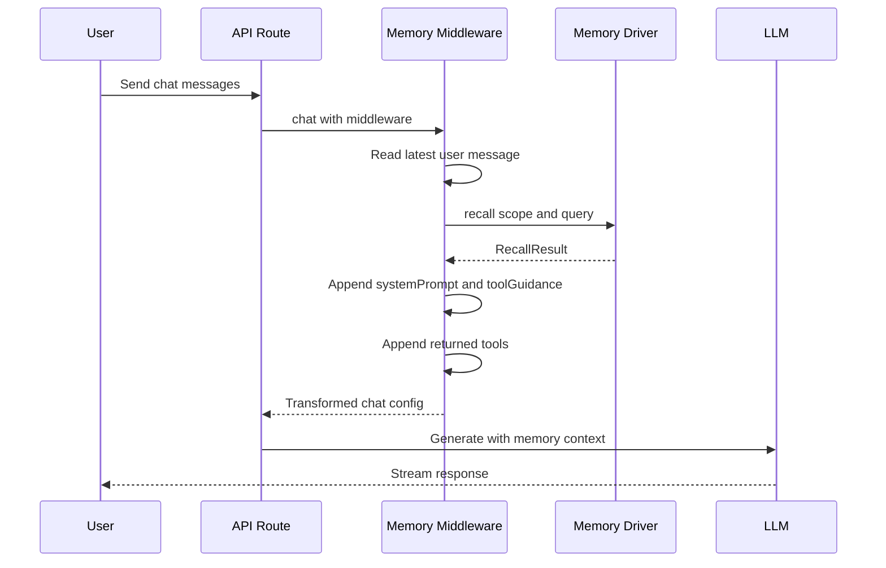
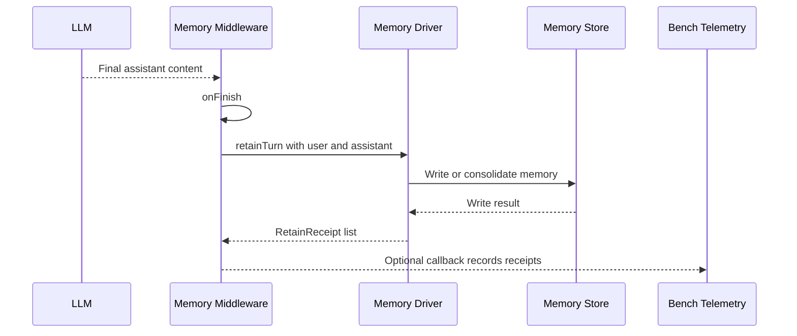
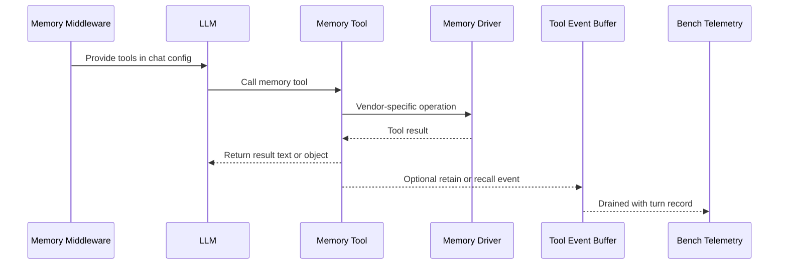

# memory-bench

`memory-bench` is a TanStack AI memory benchmark and demo app. It compares
multiple long-term memory engines behind one shared interface, then shows how
memory changes an agent's prompt, tools, retained facts, and timeline over
time.

The repo has two main parts:

- `apps/web`: TanStack Start app with chat routes, the benchmark UI, session
  telemetry, Docker engine services, and local memory stage implementations.
- `packages/ai-memory`: shared `@tanstack/ai-memory` package with the
  `MemoryDriver` protocol, TanStack AI memory middleware, provider drivers,
  and composition helpers.

## What This Is

This project is both a benchmark harness and an integration example:

- It lets you run the same conversation through Hindsight, mem0, Honcho, and a
  local composed memory driver.
- It exposes one active engine to the model for recall while optionally
  retaining the completed turn into multiple engines.
- It records recalls, retains, tool events, and memory snapshots so you can see
  how each memory system behaves over time.
- It demonstrates the middleware-first integration in `@tanstack/ai-memory`,
  where recall happens before generation and retain happens after generation.

The goal is not to declare a universal winner. The goal is to make differences
visible: what each engine recalls, what it chooses to store, how fast it
updates, whether it exposes tools, and how its memory model affects the next
assistant response.

## System Requirements

- Node.js 22+.
- pnpm 10+.
- Docker Desktop or Docker Engine with Compose v2, required for Hindsight,
  mem0, and Honcho.
- Anthropic API key for the default chat model and several memory services.
- OpenAI API key for mem0 and the local composed driver embeddings.

The app defaults are:

- Web app: `http://localhost:3000`
- Hindsight API: `http://localhost:8888`
- Hindsight UI: `http://localhost:9999`
- mem0 API: `http://localhost:8000`
- Honcho API: `http://localhost:8001`

## Installation

Install dependencies from the repo root:

```bash
pnpm install
```

Create the app environment file:

```bash
cp apps/web/.env.example apps/web/.env
```

Fill in at least:

```env
ANTHROPIC_API_KEY=
OPENAI_API_KEY=
```

Optional service URL defaults already match `apps/web/docker-compose.yml`:

```env
HINDSIGHT_URL=http://localhost:8888
MEM0_URL=http://localhost:8000
MEM0_ADMIN_API_KEY=
HONCHO_URL=http://localhost:8001
HONCHO_APP_NAME=memory-bench

MODEL_CHAT=claude-sonnet-4-5
MODEL_EXTRACTION=claude-haiku-4-5
```

## Running The App

Start all Docker-backed memory engines:

```bash
cd apps/web
docker compose --profile engines up -d
cd ../..
```

You can also start one engine at a time:

```bash
cd apps/web
docker compose --profile hindsight up -d
docker compose --profile mem0 up -d
docker compose --profile honcho up -d
cd ../..
```

Run the web app:

```bash
pnpm dev
```

Open `http://localhost:3000`.

## Testing

Run all repo tests through Nx:

```bash
pnpm test
```

Run TypeScript checks:

```bash
pnpm typecheck
```

Build all projects:

```bash
pnpm build
```

Useful focused commands:

```bash
pnpm --filter @tanstack/ai-memory test
pnpm --filter @tanstack/ai-memory typecheck
pnpm --filter memory-bench-web typecheck
```

Some provider tests are live-service aware and skip when their backing service
is not reachable.

## What Memory For Agents Means

An LLM by itself only sees the prompt you send with the current request. Agent
memory is the application layer that decides what should survive beyond that
single model call and how to reintroduce it later.

In this repo, agent memory has three responsibilities:

- **Recall**: find relevant durable memory before generation and add it to the
  model context.
- **Retain**: decide what from the completed turn should be written for future
  sessions or future turns.
- **Tool control**: optionally let the model query, write, or reflect over
  memory explicitly through normal TanStack AI tools.

The `@tanstack/ai-memory` package models this with a `MemoryDriver`:

```ts
interface MemoryDriver {
  id: EngineId;
  recall(scope: Scope, query: string): Promise<RecallResult>;
  retainTurn(scope: Scope, input: RetainInput): Promise<Array<RetainReceipt>>;
  inspect(scope: Scope): Promise<MemorySnapshot>;
  listFacts(scope: Scope): Promise<FactList>;
}
```

The middleware wrapper adapts that protocol to TanStack AI's chat lifecycle.

## Types Of LLM Memory

LLM apps usually combine several memory layers:

- **Context-window memory**: the current messages, system prompts, and
  documents sent to the model. It is immediate and exact, but disappears after
  the request.
- **Working memory**: temporary state inside an active run, such as plans,
  intermediate tool results, streamed state, or scratchpads.
- **Retrieval memory**: external information fetched from files, search,
  databases, or vector stores. This often represents source material rather
  than things learned from conversation.
- **Long-term user/application memory**: durable facts, preferences,
  observations, summaries, or experiences retained across turns and sessions.
- **Model memory**: information encoded in model weights through training or
  fine-tuning. It is useful background knowledge, but not inspectable or
  updateable per user at runtime.

This repo focuses on **long-term user/application memory**. The benchmark
asks: when the same conversation is fed into different memory systems, what do
they remember, recall, and expose back to the agent?

## Memory Engines

| Engine                                       | Integration                                         | Recall                                          | Retain                                        | Tools                                                       |
| -------------------------------------------- | --------------------------------------------------- | ----------------------------------------------- | --------------------------------------------- | ----------------------------------------------------------- |
| [Hindsight](https://hindsight.vectorize.io/) | Docker service via `@vectorize-io/hindsight-client` | Structured recall rendered into a system prompt | User and assistant retained separately        | `hindsight_retain`, `hindsight_recall`, `hindsight_reflect` |
| [mem0](https://mem0.ai)                      | Docker service via REST API                         | Search results rendered into a memory block     | Conversation posted to `/memories`            | none                                                        |
| [Honcho](https://honcho.dev)                 | Docker service via `@honcho-ai/sdk`                 | `userPeer.chat()` synthesis                     | Messages added to a Honcho session            | none                                                        |
| Local                                        | In-process composed driver                          | App-owned stages search and render facts        | Extract, consolidate, and store facts locally | depends on configured `ToolFactory`                         |

The app can compare engines while keeping the chat route mostly engine
agnostic. Each provider returns the same `RecallResult` shape:

- `systemPrompt`: text to add to `systemPrompts`.
- `fragments`: discrete recalled items for debugging and UI.
- `tools`: TanStack AI tools to expose to the model.
- `toolGuidance`: system prompt text explaining when to use those tools.

## Middleware Roles

`createMemoryMiddleware` supports two roles:

- `recall+retain`: recall before generation, inject prompts and tools, then
  retain after generation. Use this for the memory engine that should
  influence the current response.
- `retain-only`: skip recall and only write the completed turn. Use this when
  you want to fan out the same conversation to additional memory engines
  without letting all of them modify the prompt.

`composeMemoryMiddleware` proxies multiple memory middlewares as one
TanStack AI middleware.

## Recall Flow

Recall is the "before" half of memory. It happens during TanStack AI
`onConfig`, before the model call.



The important point: memory is not a side channel. Recalled content is added
to the actual model configuration as system prompt text, and returned tools
are normal TanStack AI tools.

## Retain Flow

Retain is the "after" half of memory. It happens only after the model
finishes normally.



`ctx.defer(...)` keeps the retain work from blocking response streaming. The
bench routes can use optional callbacks to record receipts, turn rows, and
snapshots for the UI.

## Tool Flow

Some engines expose model-callable memory tools. Hindsight returns tools for
direct retain, recall, and reflect. Other engines may return no tools.



Tool calls are optional and model-directed. Middleware recall still happens
automatically for the active `recall+retain` engine.

## Project Layout

```text
apps/web/
  src/routes/
    api.chat.ts                 benchmark chat route with middleware fanout
    api.simple-chat.ts          minimal memory middleware example
    api.memory.*                inspect and facts endpoints
    api.sessions.*              import, export, reset, timeline
  src/server/memory/            engine registry, orchestration, tool events
  src/server/bench-db/          SQLite telemetry schema and repository
  src/memory/                   local composed memory stages
  docker-compose.yml            Hindsight, mem0, and Honcho services

packages/ai-memory/
  src/index.ts                  MemoryDriver protocol and public types
  src/middleware.ts             createMemoryMiddleware and composeMemoryMiddleware
  src/providers/hindsight/      Hindsight driver and tools
  src/providers/mem0/           mem0 REST driver
  src/providers/honcho/         Honcho driver
  src/factory.ts                createComposedDriver
  src/types/stages.ts           local driver stage interfaces
```

## More Documentation

- `packages/ai-memory/README.md`: package-level middleware and vendor guide.
- `packages/ai-memory/docs/protocol.md`: `MemoryDriver` contract.
- `packages/ai-memory/docs/integrations.md`: provider details.
- `packages/ai-memory/docs/composition.md`: composing a local memory driver.
- `apps/web/README.md`: app-specific benchmark notes.
