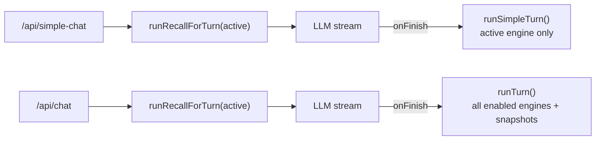

# memory-bench — status

_2026-05-15_

## Repo shape

NX/pnpm monorepo:

- [apps/web](apps/web) — TanStack Start app (UI + API routes + bench DB).
- [packages/ai-memory](packages/ai-memory) — `@tanstack/ai-memory` shared package: driver interface + the Hindsight, mem0, Honcho, and TanMemory engines.

## Routes (as of today)

| Route | Purpose | Chat API | Memory scope |
|-------|---------|----------|--------------|
| **`/`** | Simplified chat for iteration. Header with provider selector + Reset. 75% chat / 25% facts for the **selected** provider. | `POST /api/simple-chat` | **Active engine only** (no fan-out). |
| **`/memory-bench`** | Original 5-column bench: engine selector, mode toggle, script runner, turn timeline, chat + 4 fact columns. | `POST /api/chat` | **All 4 engines** (fan-out). |
| `/runs/$runId`, `/$sessionId/scrub/$turnN` | Run / scrub deep links from the bench. | n/a | n/a |

`routeTree.gen.ts` is auto-regenerated by `@tanstack/router-plugin`; do not hand-edit.

## Chat pipelines

Both endpoints share the same shape (recall → stream → middleware-deferred retain) and write to the same `globalThis.__lastRecallBySession` / `__lastTurnBySession` slots that `ChatPanel`'s last-recall and last-turn polling consume.



- [apps/web/src/server/memory/orchestrator.ts](apps/web/src/server/memory/orchestrator.ts) hosts both `runTurn` (fan-out) and the new `runSimpleTurn` (active engine only, no `capturePreSnapshots` / `schedulePostSnapshots`, no `drainToolEvents` bridge — still records `insertTurn` / `insertRecall` / `insertRetains` so debug polling + facts panel keep working).
- [apps/web/src/routes/api.simple-chat.ts](apps/web/src/routes/api.simple-chat.ts) is the new endpoint, intentionally a near-clone of [apps/web/src/routes/api.chat.ts](apps/web/src/routes/api.chat.ts) so the simple UI works end-to-end on day one and we can evolve it independently.

## UI

- [apps/web/src/routes/index.tsx](apps/web/src/routes/index.tsx) — `SimpleChatPage`. Reuses `EngineSelector`, `ChatPanel`, `MemoryPanel`, `useSessionId`/`resetSessionId`. Reset button hits `POST /api/sessions/reset` (still wipes all engines + local data dirs) and rotates the session.
- [apps/web/src/routes/memory-bench.tsx](apps/web/src/routes/memory-bench.tsx) — original `ChatBenchPage`, unchanged behavior, just relocated from `/` to `/memory-bench`.
- [apps/web/src/components/memory/ChatPanel.tsx](apps/web/src/components/memory/ChatPanel.tsx) gained an optional `chatEndpoint` prop (defaults to `/api/chat`); `/` passes `/api/simple-chat`. Everything else (last-recall expansion, debug polling, autoplay) is untouched.

## Engines

Unchanged in this round — `@tanstack/ai-memory` exposes Hindsight, mem0, Honcho, and TanMemory. The simplified `/` works against any of the four; switching providers mid-session leaves stale facts on the previously selected engine (use "Reset" for a clean slate).

## How to run

```bash
cp apps/web/.env.example apps/web/.env   # fill ANTHROPIC_API_KEY, etc.
docker compose --profile engines up -d   # see apps/web/docker-compose.yml
pnpm dev                                 # serves /, /memory-bench
```

- `pnpm typecheck` — clean.
- `pnpm --filter memory-bench-web build` — green, route tree regenerates `/`, `/memory-bench`, `/api/chat`, `/api/simple-chat`.

## Known / deferred

- `/api/simple-chat` is intentionally a clone of `/api/chat` minus the fan-out — the next round of work will diverge it (custom system prompt, tool surface, etc.) without touching the bench.
- No tests yet for `runSimpleTurn`; orchestrator tests cover the fan-out path only.
- Switching engine on `/` does **not** migrate facts between engines (by design — Reset is the escape hatch).
